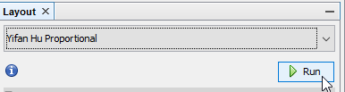
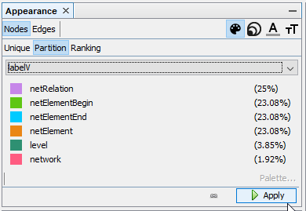
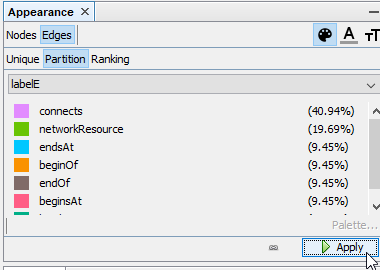
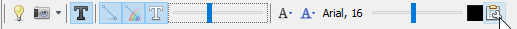
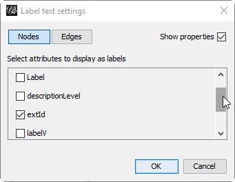
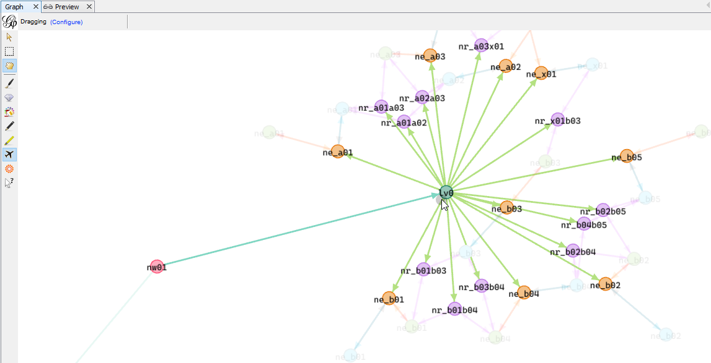

# TinkerPop REST API
A sample implementation of 
- parsing a railML 3.1 file to a TinkerGraph
- and providing a REST API to query the graph again. 

## API provided
See Swagger UI opening the application in the browser. 

## Hints
### railML 3.1 used
You can use the environment variable `RAILML_TO_LOAD` to point the application to a local resource using `file:///...` schema.

If nothing is configured the application defaults to loading the official [railML 3.1 sample](https://svn.railml.org/railML3/tags/railML-3.1-final/examples/railML.org_SimpleExample_v11_railML3-1_04.xml).

### Fixing "SunCertPathBuilderException" when loading the official railML 3.1 sample
How to solve the exception `sun.security.validator.ValidatorException: PKIX path building failed: sun.security.provider.certpath.SunCertPathBuilderException: unable to find valid certification path to requested target`.

The official railML 3.1 sample is provided via `https://`. It may be that your Java keystore does not yet trust the intermediate CA certificate used to sign `*.railml.org`.

To fix this:
- use your browser to open the link
- view the certificate chain used
- export e.g. the missing `AlphaSSL CA - SHA256 - G2` to `alphassl_ca_SHA256_G2.cer` file (using _DER encoded binary_)
- import the certificate into your JREs default keystore (default password is `changeit`)
```
> keytool -import -keystore c:\_\jdk1.8.0_202\jre\lib\security\cacerts -file e:\temp\alphassl_ca_SHA256_G2.cer
``` 

### Graph created
The graph created from parsing the railML file is persisted to the temporary directory as GraphML file named `current_railML_import.graphml`. 

### Viewing the graph created
- Download [Gephi](https://gephi.org/) for your platform
- open the GraphML file created
- configure the visualization
  - __Layout__ tool window: use a layouting algorithm like `Yifan Hu Proportional`
  
  - __Appearance__ tool window:
    - color __Nodes__ by configuring __Partition__ by `labelV`
    
      
      
    - color __Edges__ by configuring __Partition__ to `labelE`
    
      
      
  - configure __Graph view__
      - activate __Show Node labels__
      
        
        
      - use `extId` as __Label text__
      
        

- this results in the sample graph showing `/railML/infrastructure/topology` with the information
  - `network` called `nw01` with `network/level` called `lv0` (micro level),
  - highlighting some `netElement` entries prefixed with `ne_` and some `netRelation` prefixed with `nr_`
  
  
